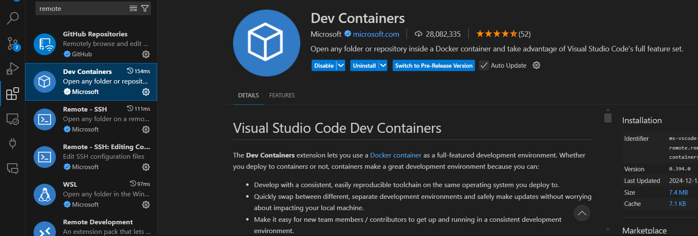
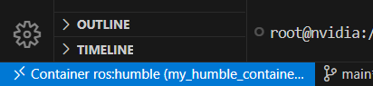

# Installation

It is a known issue that running PSDK requires root access and has multiple permission issues when running with ROS2. As such, it is recommended to run the wrapper inside a Docker container.

## Create a ROS2 workspace and download the repo

```bash
mkdir -p ~/ros2_ws/src
cd ~/ros2_ws/src
git clone https://github.com/lucvt001/psdk_ros2_wrapper.git
```

## Build the image

```bash
cd /path/to/psdk_ros2_wrapper/docs
docker build -t psdk_ros2_humble .
```

## Start container for the first time and build the workspace

When you first get started, you need to start a container, attach the local `ros2_ws` to the container, and build the workspace.

```bash
docker run -it --privileged \
    --env="DISPLAY" \
    --env="QT_X11_NO_MITSHM=1" \
    --volume="/tmp/.X11-unix:/tmp/.X11-unix:rw" \
    --ipc=host \
    --runtime=nvidia \
    --network=host \
    -v /dev:/dev -v /dev/shm:/dev/shm \
    -v ~/ros2_ws:/ros2_ws \
    --name my_humble_container \
    psdk_ros2_humble
```

Then, inside the container, build the workspace:

```bash
apt update && apt upgrade -y
colcon build --symlink-install
```

## Subsequent runs

For typical operations, upon booting up the Jetson module, do the following steps:

```bash
docker start my_humble_container
```

Ensure that you installed `Dev Container` plugin in VSCode (both locally and for the ssh device).



Connect to the container:

`Ctrl+Shift+P` -> `Remote-Containers: Attach to Running Container` -> `my_humble_container`

If done correctly, you should see this:




